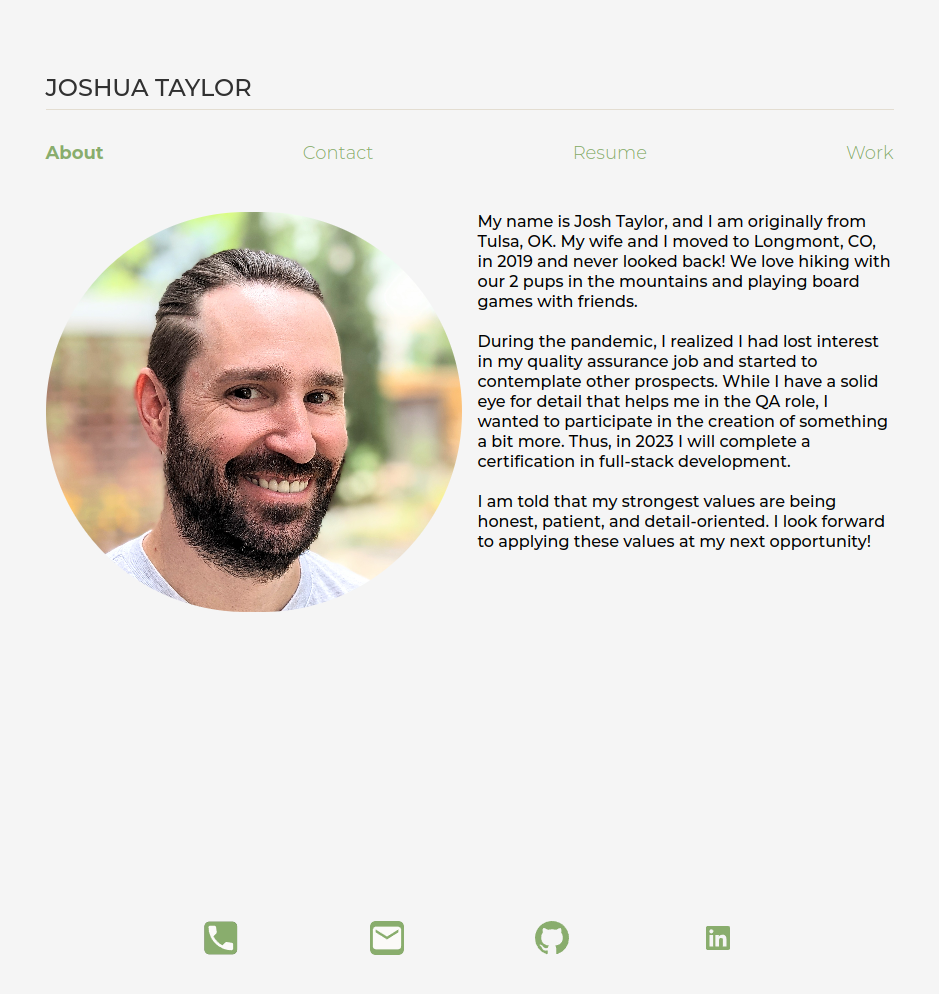

# react-portfolio

## Description

This is my portfolio page giving a little about myself, displaying some of my work, and a few ways to get in contact with me. It is built using react. It is a place for potential employers to get to know me and my work. It is the culmination of everything I have learned of front-end development during my time at the DU Full Stack Coding Bootcamp.

## Installation

N/A

## Usage

The website is responsive to screen sizes, resizing as needed. The projects in the Work tab can be clicked to open the deployed sites in a separate tab. There are several contact links and a form to send me a message. The resume tab has a button to download a pdf of my resume. The download resume and contact me sections are not currently functional and will be updated at another time. They are included for future development.

 Deployed page link: https://josht-dev.github.io/react-portfolio/

## Credits

N/A

## License

Refer to the LICENSE in the repo for the code. 
The font (Montserrat) is licensed under the SIL Open Font License (OFL).